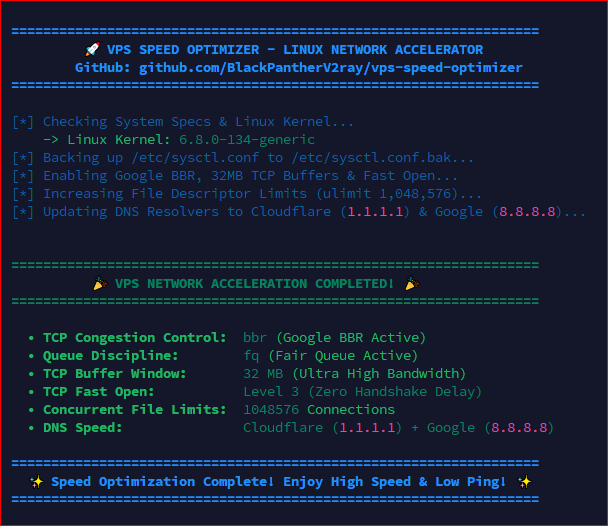

# 🚀 VPS Speed Optimizer - Ultra Network & Google BBR Booster

<p align="center">
  
  
  
  
  
</p>

An automated, 1-click Linux VPS Network Acceleration script designed to unleash the maximum throughput, reduce packet loss, eliminate bufferbloat, and optimize speeds for **VPN Servers (V2Ray / Xray / 3x-ui / OpenSSH / WireGuard), Web Servers, and Cloud VPS Nodes**.

<p align="center">
  
</p>

---

## ⚡ 1-Line Fast Execution (Instant Setup)

Log in to your VPS terminal via SSH as `root` and run this single command:

```bash
bash <(curl -fsSL https://raw.githubusercontent.com/BlackPantherV2ray/vps-speed-optimizer/main/optimize.sh)
```

*Or using `wget`:*
```bash
wget -qO- https://raw.githubusercontent.com/BlackPantherV2ray/vps-speed-optimizer/main/optimize.sh | bash
```

---

## 🌟 What This Optimizer Does:

| Feature | Default Linux | With VPS Speed Optimizer |
| :--- | :--- | :--- |
| **TCP Congestion Control** | `Cubic` / `Reno` (Slows down on packet loss) | **`Google BBR` + `FQ`** (Maintains full speed) |
| **TCP Buffer Window** | 4 MB - 8 MB (Low bandwidth) | **32 MB Maximum** (Ultra 4K & fast downloads) |
| **TCP Fast Open (TFO)** | Disabled (`0`) | **Level 3 Enabled** (Zero handshake latency) |
| **Idle Browsing Throttling** | Slow start penalty enabled | **Disabled** (Full speed even after pausing) |
| **Concurrent File Descriptors** | 1,024 connections | **1,048,576 connections** (No peak-hour lag) |
| **DNS Resolution** | Default slow ISP/Hosting DNS | **Cloudflare (1.1.1.1) + Google (8.8.8.8)** |

---

## 🎯 Key Benefits:

1. **🛡️ Anti-Throttling on Mobile 4G/5G Networks**:
   - Standard TCP cuts speeds by up to 50% whenever a wireless packet is dropped. Google BBR accurately models bottleneck bandwidth and Round Trip Time (RTT), delivering steady full-speed streaming.
2. **📺 Buffer-Free 4K Streaming & Downloads**:
   - The 32MB TCP window buffer allows streaming services (YouTube, TikTok, Netflix, Reels) to buffer ahead instantly without frame drops.
3. **🎮 Low Latency (Ping) for Online Gaming**:
   - Eliminates queue buildup (bufferbloat) on the server, ensuring competitive gaming ping remains stable during heavy downloads.
4. **👥 High Multi-User Capacity**:
   - Boosts file limits (`ulimit`) to 1 Million, allowing 50+ to 100+ concurrent VPN / Tunnel connections without dropping packets.

---

## 💻 System Compatibility

- **Ubuntu**: 20.04 LTS, 22.04 LTS, 24.04 LTS
- **Debian**: 10 (Buster), 11 (Bullseye), 12 (Bookworm)
- **CentOS / AlmaLinux / Rocky Linux**: 8, 9
- **VPN / Proxy Protocols Supported**: 3x-ui, X-UI, VLESS, VMess, Trojan, Shadowsocks, SSH, OpenVPN, WireGuard, Hysteria2.

---

## 🔄 How to Verify After Running

Run this command anytime in your VPS terminal to verify BBR is active:
```bash
sysctl net.ipv4.tcp_congestion_control
```
*Expected Output:*
```text
net.ipv4.tcp_congestion_control = bbr
```

---

## 📞 Support & Community

- **Developer**: Black Panther
- **Official Telegram**: [@Black_Panther_V2ray](https://t.me/Black_Panther_V2ray)
- **Project Repository**: [https://github.com/BlackPantherV2ray/vps-speed-optimizer](https://github.com/BlackPantherV2ray/vps-speed-optimizer)

---

## 📄 License
Released under the [MIT License](LICENSE) © 2026 **Black Panther / Tunnel Forde LK**.
